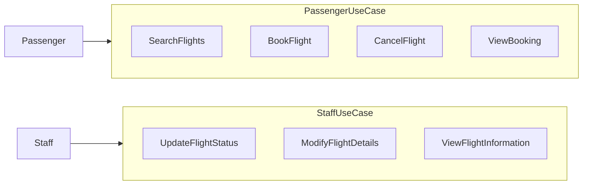

# Flight Management System
This is a system that helps hotel owners and managers to manage the various operations in a hotel.

## Function Requirement

- Passenger should be able to:
  - Book flights
  - Search flights between airports
  - View flight details (flight number, departure city, arrival city, departure time, arrival time, flight status, and available seats)
  - View booking
  - Cancel booking

- Staff should be able to:
  - Set flight status
  - Modify flight details (change start and end city)
  - View flight information

## Non-Functional Requirement
- Scalable
- Testable
- Modular

## Diagrams

## Explanation