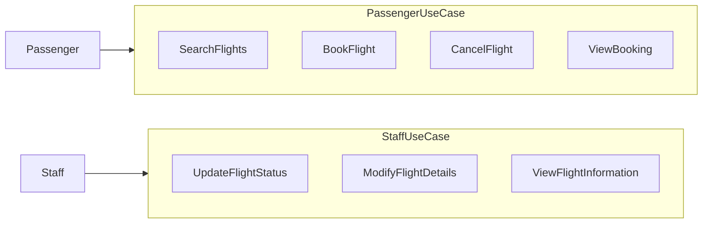

# Flight Management System
This is a system that helps hotel owners and managers to manage the various operations in a hotel.

## Function Requirement

- Passenger should be able to:
  - Book flights
  - Search flights between airports
  - View flight details (flight number, departure city, arrival city, departure time, arrival time, flight status, and available seats)
  - View booking
  - Cancel booking

- Staff should be able to:
  - Set flight status
  - Modify flight details (change start and end city)
  - View flight information

## Non-Functional Requirement
- Scalable
- Testable
- Modular

## Diagrams

### Use-case Diagram

### Class Diagram

```mermaid
classDiagram
    class Flight {
        -flightId: string
        -flightName: string
        -arrivalCity: string
        -destinationCity: string
        -arrivalTime: string
        -departureTime: string
        -status: FlightStatus
        -capacity: int
        -availableSeats: int
        +Flight(flightId: string, flightName: string, arrivalCity: string, destinationCity: string, arrivalTime: string, departureTime: string, status: FlightStatus, capacity: int)
        +setFlightStatus(status: FlightStatus): void
        +getAvailableSeats(): int
        +getTotalSeats(): int
        +acquireSeat(): bool
        +releaseSeat(): bool
        +getFlightId(): string
        +getFlightName(): string
        +getArrivalCity(): string
        +setArrivalCity(arrivalCity: string): void
        +getDestinationCity(): string
        +setDestinationCity(destinationCity: string): void
        +getArrivalTime(): string
        +setArrivalTime(arrivalTime: string): void
        +getdepartureTime(): string
        +setdepartureTime(departureTime: string): void
    }

    class Passenger {
        -name: string
        -emailId: string
        -bookingIds: unordered_set<string>
        +Passenger(name: string, emailId: string)
        +getName(): string
        +getBookingIds(): unordered_set<string>
        +viewBookings(): void
        +addBookingId(bookingId: string): void
        +removeBookingId(bookingId: string): void
    }

    class Booking {
        -bookingId: string
        -flight: Flight*
        -passenger: Passenger*
        -status: BookingStatus
        +Booking(bookingId: string, flight: Flight*, passenger: Passenger*, status: BookingStatus)
        +getBookingId(): string
        +getFlight(): Flight*
        +getPassenger(): Passenger*
        +getStatus(): BookingStatus
        +setBookingStatus(status: BookingStatus): void
        +cancelBooking(): void
        +ViewBooking(): void
    }

    class ITicketPriceAdvisor {
        +calculatePrice(flight: Flight*): double
    }

    class TicketPriceAdvisor {
        +calculatePrice(flight: Flight*): double
    }

    class IPayment {
        +pay(amount: double): void
    }

    class CreditCard {
        +pay(amount: double): void
    }

    class Staff {
        -name: string
        -staffId: string
        +Staff(name: string, staffId: string)
    }

    class FlightManagementSystem {
        -flights: unordered_map<string, unordered_set<Flight*>>
        -distribution: uniform_int_distribution<int>
        -generator: default_random_engine
        -BOOKING_ID_LENGTH: const int
        +generateBookingId(): string
        +addFlight(flight: Flight*): void
        +removeFlight(flight: Flight*): void
        +searchFlight(arrivalCity: string, destinationCity: string): void
        +bookFlight(passenger: Passenger*, flight: Flight*): Booking*
        +cancelBooking(booking: Booking*): void
        +setBookingStatus(booking: Booking*, status: BookingStatus): void
        +viewFlightDetails(flight: Flight*): void
        +modifyFlightStatus(flight: Flight*, status: FlightStatus): void
        +modifyFlightArrivalCity(flight: Flight*, arrivalCity: string): void
        +modifyFlightDestinationCity(flight: Flight*, destinationCity: string): void
        +modifyFlightArrivalTime(flight: Flight*, arrivalTime: string): void
        +modifyFlightdepartureTime(flight: Flight*, departureTime: string): void
    }

    class BookingStatus{
      <<Enumeration>>  
      OnTime,
      Canceled,
      Delayed,  
      Arrived,
      SecurityCheck,
      OutOfService,
      Ready,
      ReadyForBoarding,
      Boarding,
      Departed
    }

    class FlightStatus{
      <<Enumeration>>
      PaymentPending,
      Confirmed,
      Waitlisted,
      Canceled  
    }

    Flight <-- ITicketPriceAdvisor
    TicketPriceAdvisor --|> ITicketPriceAdvisor
    Booking o-- Flight
    Booking *-- Passenger
    IPayment <|.. CreditCard
    FlightManagementSystem --> Flight
    FlightManagementSystem --> Passenger
    FlightManagementSystem --> Booking

```

## Explanation
Certainly! Here's the explanation of the provided code in Markdown format:

## Flight Management System Explanation

The provided code implements a Flight Management System in C++, simulating a simplified airline booking system. It consists of various classes representing different entities and their interactions. Let's delve into the main components and their functionalities:

### Base Entities

- **`enum class FlightStatus`**: This enumeration defines various flight statuses, such as "OnTime," "Delayed," "Canceled," and more.

- **`enum class BookingStatus`**: This enumeration represents booking statuses like "Confirmed," "Canceled," etc.

- **`Flight`**: The `Flight` class represents a flight entity. It contains attributes like flight ID, name, arrival city, departure city, departure time, status, capacity, and available seats. It manages seat availability, booking, and releasing. Passengers can inquire about available seats, acquire seats, and release them.

- **`Passenger`**: Represents a passenger with attributes including name, email, and a set of booking IDs. Passengers can view their bookings, add booking IDs, and remove them.

- **`Staff`**: Represents staff members associated with the airline, defined by a name and staff ID.

- **`Booking`**: This class encapsulates booking information. It holds a booking ID, flight, passenger, and booking status. Passengers can view booking details and cancel bookings.

- **`ITicketPriceAdvisor`**: This is an interface representing a ticket price advisor. Subclasses can implement the `calculatePrice` method to calculate ticket prices for different flights.

- **`IPayment`**: An interface representing payment methods. Subclasses can implement the `pay` method for payment-related actions.

### Entity Implementations

- **`TicketPriceAdvisor`**: This class implements the `ITicketPriceAdvisor` interface. It provides a simple fixed price for ticket calculations.

- **`CreditCard`**: This class implements the `IPayment` interface. It simulates credit card payment, allowing payment of a specified amount.

### Flight Management System

- **`FlightManagementSystem`**: This class serves as the core of the system. It manages flights, bookings, and their interactions.
  - It contains an `unordered_map` called `flights`, where the key is a concatenation of source and destination cities, and the value is a set of `Flight*`.
  - Methods include adding and removing flights, searching for flights between cities, booking flights, canceling bookings, and modifying flight details.
  - It generates booking IDs using random characters.

### Main Function (`main`)

- Inside the `main` function:
  - Instances of `FlightManagementSystem`, `CreditCard`, and `TicketPriceAdvisor` are created.
  - Flights are created and added to the system.
  - Passengers are created.
  - Flight searches and bookings are demonstrated.
  - Payment is processed using the `CreditCard` class, and ticket prices are calculated using the `TicketPriceAdvisor`.
  - Booking statuses are set, and booking details are displayed.
  - Booking cancellations are demonstrated.
  - The program terminates.

Keep in mind that this code represents a simplified flight management system for demonstration purposes. It lacks some real-world complexities such as persistence, authentication, security, and comprehensive error handling that a production system would require.