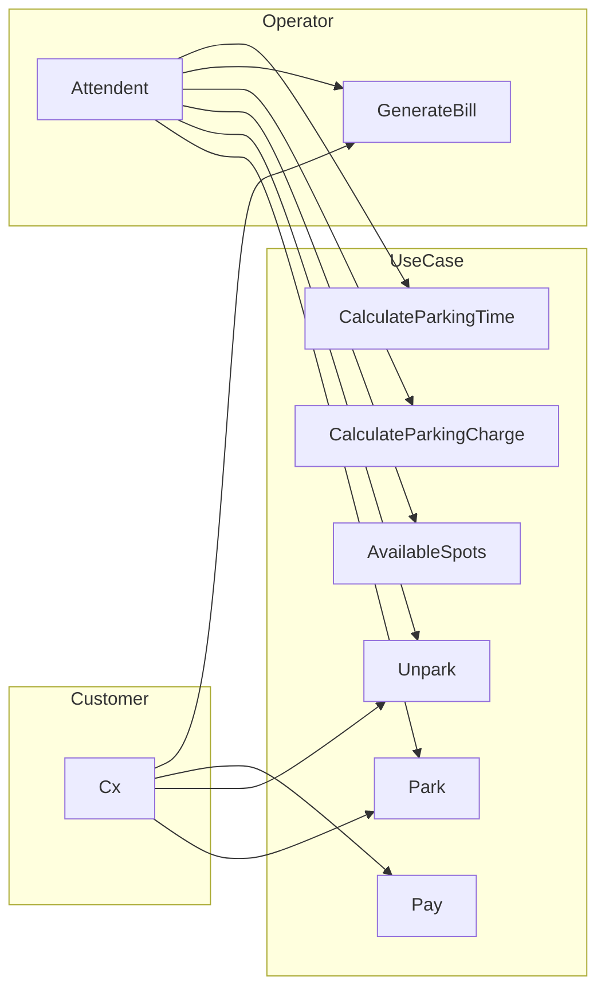

# Parking Lot

## Functional Requirement
- Park different vehicles - Cars, Bikes and Handicapped Vehicles
- Unpark the vehicles
- Check availability of parking spots on a specific floor
- Track parking time of each vehicle
- Calculate cost of parking for different vehicle types

## Non-Functional Requirement
- Scalable and extensible
- Easy to test and understand
- Efficient and quickly respond to user requests

## Use-Case Diagram

## Entities
- Vehicle
  - TwoWheeler, FourWheeler, Wheelchair
- PaymentAdvisor
  - CreditCard, DebitCard, UPI
- PaymentMode
- ParkingTicket
- ParkingLot
  

## Class Diagram

## Solution

# A parking lot simulation in C++

This program simulates a parking lot with the following features:

* It can park cars, bikes, and wheelchairs.
* It calculates the parking charge based on the type of vehicle and the duration of parking.
* It generates a parking bill for the vehicle.
* It allows the user to pay the parking charge using a credit card or a debit card.

The program defines the following classes:

* `PaymentAdvisor`: An abstract class that represents a payment advisor. It has a pure virtual function `calculateCharge()` that returns the parking charge for a vehicle.
* `Vehicle`: An abstract class that represents a vehicle. It has the following properties:
    * `registrationNumber`: The registration number of the vehicle.
    * `color`: The color of the vehicle.
    * `vehicleType`: The type of the vehicle (car, bike, or wheelchair).
    * `paymentAdvisor`: A pointer to the payment advisor for the vehicle.
    * `parkingStartTime`: The time at which the vehicle was parked.
    * `parkingEndTime`: The time at which the vehicle was unparked.
    * `parkingDuration`: The duration for which the vehicle was parked.
    * `calculateCharge()`: A function that returns the parking charge for the vehicle.
* `ParkingTicket`: A class that represents a parking ticket. It has the following properties:
    * `vehicle`: A pointer to the vehicle that was parked.
    * `parkedLocation`: The location where the vehicle is parked.
* `PaymentMode`: An abstract class that represents a payment mode. It has a pure virtual function `pay()` that is used to pay the parking charge.
* `CreditCard` and `DebitCard` are concrete classes that implement the `PaymentMode` class.
* `ParkingLot`: A class that represents a parking lot. It has the following properties:
    * `floors`: The number of floors in the parking lot.
    * `slotsPerFloor`: The number of slots per floor.
    * `freeSlots`: The number of free slots in the parking lot.
    * `multiLevelParking`: A 2D vector that stores the parking tickets for all the floors.
    * `findFreeSlot()`: A function that finds a free slot in the parking lot.
    * `park()`: A function that parks a vehicle in the parking lot.
    * `unpark()`: A function that unparks a vehicle from the parking lot.
    * `calculateParkingCharge()`: A function that calculates the parking charge for a vehicle.
    * `freeSlotsAvailable()`: A function that returns the number of free slots in the parking lot.
    * `generateBill()`: A function that generates a parking bill for a vehicle.

The main function of the program creates a `ParkingLot` object with 2 floors and 2 slots per floor. It then creates objects of the `Car`, `Bike`, and `Wheelchair` classes. It also creates objects of the `CreditCard` and `DebitCard` classes.

The program then parks the `Car` and `Bike` objects in the parking lot. It prints the parking ticket for the `Car` object and the number of free slots available. It then parks the `Wheelchair` object in the parking lot. It prints the parking ticket for the `Wheelchair` object and the number of free slots available.

The program then unparks the `Car` object. It prints the number of free slots available. The program then generates a parking bill for the `Car` object and pays the parking charge using a credit card.

The program terminates after printing the parking charge.
