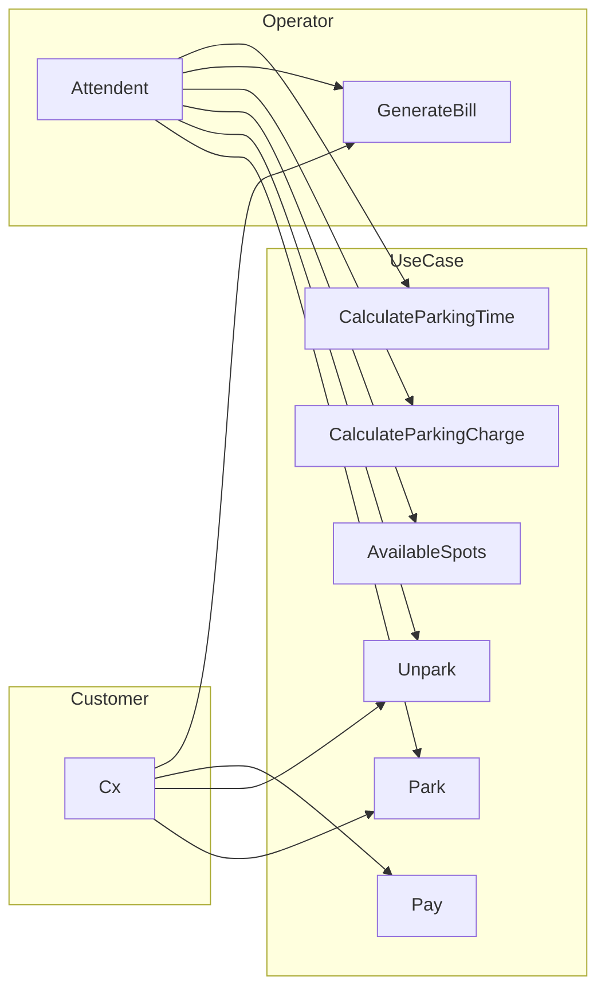
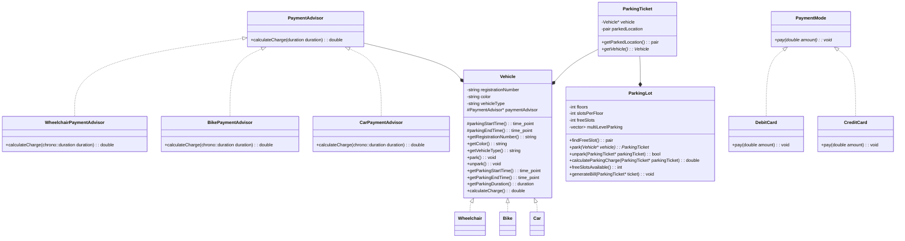

# Parking Lot

## Functional Requirement
- Park different vehicles - Cars, Bikes and Handicapped Vehicles
- Unpark the vehicles
- Check availability of parking spots on a specific floor
- Track parking time of each vehicle
- Calculate cost of parking for different vehicle types

## Non-Functional Requirement
- Scalable and extensible
- Easy to test and understand
- Efficient and quickly respond to user requests

## Use-Case Diagram

## Entities
- Vehicle
  - TwoWheeler, FourWheeler, Wheelchair
- PaymentAdvisor
  - CreditCard, DebitCard, UPI
- PaymentMode
- ParkingTicket
- ParkingLot
  

## Class Diagram
