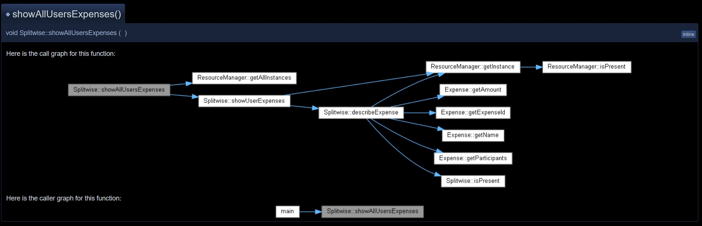

# Low Level Design Prep
Low level design practice problems and solutions

### Use Doxygen HTML documentation
With each project, there is a doxygen html folder under **media/**. You can use that to browse the HTML website that contains the documentation for that project with call graphs showing relationship, call flow amongst the classes.

## Snakes and Ladders
[Snakes and Ladders Project page](Snakes%20and%20Ladders/Snakes%20and%20Ladders.md)

## Splitwise
[Splitwise Project page](Splitwise/Splitwise.md)

