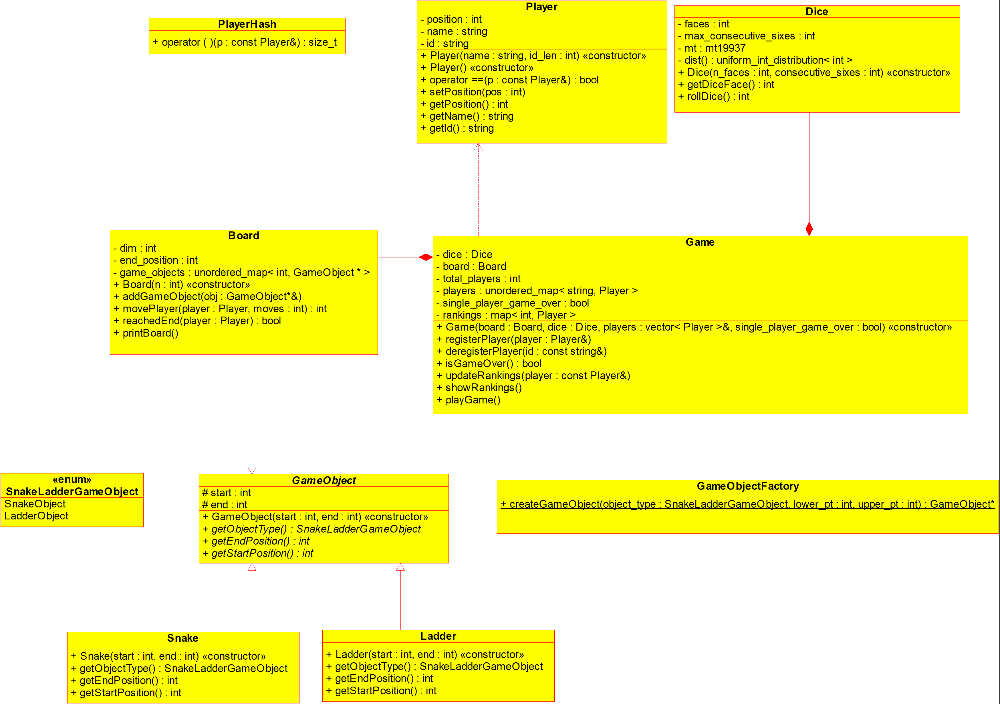

# Snakes and Ladders 

### Low Level Design - Class Diagram

## Problem Statement
### Requirements
- Create a multiplayer Snake and Ladder game. The game should take board dimension as input N from the user at the start of the game to create a board of size N x N. 
- Board can have Snakes and Ladders. Snake will have its head position at a upper point (higher number) and tail at a lower position.
Ladder will have start position at a lower position (lower number) and end at a higher position. 
- No ladder and snake make a cycle.
- None of the ends of Snake or Ladder coexist at the same board position.

### Optional Requirements
- Custom dice with 'n' faces. 
- Option to have multiple die.
- Player Leaderboard, based on finishing time.
- Game modes: Either game ends when a single player wins or continues till all the players finish.
